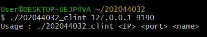
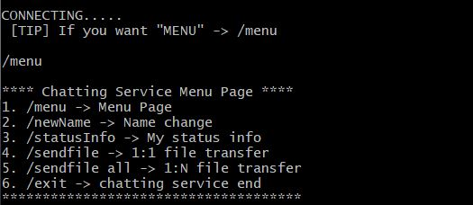
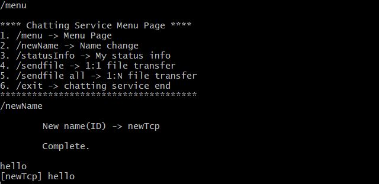
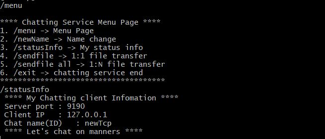
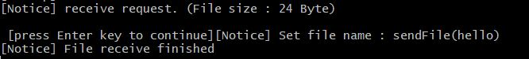
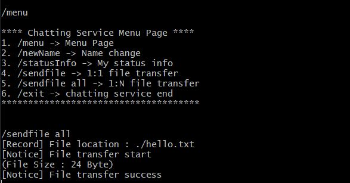

# TCP-IP-Project : Plus-Chat Service 
<h3>인하공전 컴퓨터정보과 202044032 3-A 조소담</h3>

* 프로젝트 목적: 내가 한 학기동안 TCP/IP 과목을 수강하면서 가장 중요하다고 생각이 들었던 부분은 14주차 멀티스레드 기반의 서버 구현이었다. 이번 기말 과제에서 딱 해당 범위로 하는 프로젝트였기 때문에 해당 주차에서 가장 기본이라고 생각이 들었던 server와 client 채팅 예제를 기반으로 하는 나만의 채팅 프로젝트를 주제로 정했다. 아예 새로운 주제로 프로젝트를 진행하는 것도 생각해보았지만 좀 더 확실히 멀티쓰레드를 기반으로 하는 서버와 클라이언트의 동작원리를 다시 천천히 이해하고 기본부터 다시 복습하는 마음으로 해당 프로젝트를 진행하게 되었다. 예제에서는 기본적인 채팅 기능까지만 구현이 되어있지만 개인 프로젝트이므로 내가 실제로 사용하고 싶었던 기능들을 추가로 구현했다.

* 개발환경: C, Thread, Mutex

* 프로젝트 기능

1. server

  </img>
 
우선 서버 파일을 실행하기 위해선 실행 파일명 다음에 반드시 포트번호를 입력해야한다.
 
 
  </img>
 
만약 서버에서 설정한 최대 연결 가능한 인원 수를 초과한 경우 다음과 같은 Connect Error가 발생한다.
 
 
  </img>
 
서버 파일을 실행한 후 해당 서버의 정보를 출력한다. 그 이후에 클라이언트의 활동에 따라 해당 정보들이 출력된다.
 
 
   </img>
 
클라이언트가 서버에 정상적으로 접속할때마다 실시간으로 연결 정보가 출력된다.
  
 
   </img>
 
클라이언트가 서버에서 채팅을 칠때마다 실시간으로 채팅 전송 정보가 실시간으로 출력된다.
 
 
   </img>
 
클라이언트가 서버에서 파일 전송을 할때마다 파일 크기와 파일 전송 정보가 실시간으로 출력된다.
  
 

1. client

  </img>
 
우선 클라이언트 파일을 실행하기 위해선 실행 파일명 다음에 반드시 IP주소, 포트번호, 채팅에서 사용할 ID를 입력해야한다.
 
 
  </img>
 
만약 세 가지중에 하나라도 충족이 되지 않으면 입력해야하는 정보들을 알려준다.
 
 
  </img>
 
서버와 일치하지 않는 포트 번호를 입력한 경우 Connet Error가 발생한다.
 
 
  </img>
 
서버에서 허용한 연결 가능 인원 수가 가득찬 경우에도 Error를 발생한다.
 
 
  </img>
 
정상적으로 클라이언트가 연결될 경우 채팅이 가능하다.
 
 
  </img>
 
[TIP]으로도 나와있듯이 /menu를 입력하면 메뉴를 볼 수 있다.
 
 
  </img>
 
/newName 기능은 자신이 설정한 이름(ID)를 변경할 수 있다. 입력창에 원하는 이름(ID)을 입력한 후, 채팅을 입력하면 변경된 이름(ID)으로 보내지는 것을 확인할 수 있다.
 
 
  </img>
 
/statusInfo 기능은 현재 자신의 연결 정보를 확인할 수 있다.  확인 가능한 정보는 연결된 IP주소, 포트번호, 자신의 이름(ID)이 있다.
 
 
  </img>
 
/sendfile 기능은 원하는 사용자에게 파일을 전송할 수 있는 기능이다.  
처음으로 파일의 위치를 입력하고 누구에게 보낼건지 입력한다. 이때 상대방의 이름(ID)을 입력해야한다. 
두 가지를 모두 입력하면 전송할 파일 크기를 알려주고 파일 전송을 시작한다.  
정상적으로 파일이 전송된 경우, 파일을 성공적으로 전송했다는 정보를 출력해준다.
 
 
  </img>
 
파일을 수신하는 사용자들은 우선 파일의 크기와 함께 파일 수신 요청을 받게 된다. 
수신자는 받는 파일의 이름을 자신이 임의로 설정할 수 있으며 입력한 후에는 정상적으로 파일 전송이 완료된다.
 
 
  </img>
 
/sendfile all 기능은 현재 채팅 서버에 연결되어 있는 모든 사용자들에게 파일을 한번에 전송할 수 있다. 
일반 파일 전송과 마찬가지로 전송할 파일의 위치를 입력하면 보낼 사용자들의 정보를 입력하지 않아도 바로 전송이 시작된다.
 
 
  </img>
  </img>
 
파일 전송과 동시에 현재 서버에 연결되어 있는 모든 사용자들에게 파일 수신 요청을 받게 된다.
  마찬가지로 파일의 이름을 마음대로 입력하게 되면 정상적으로 파일 전송이 완료된다.
 
 
  </img>
  </img>
 
파일 전송 기능을 사용할 때 파일의 위치나 사용자의 이름을 올바르지 못하게 입력한 경우 Error가 발생하게 된다.
 
 
  </img>
 
/exit 기능으로 채팅 서비스를 종료할 수 있다.
 
